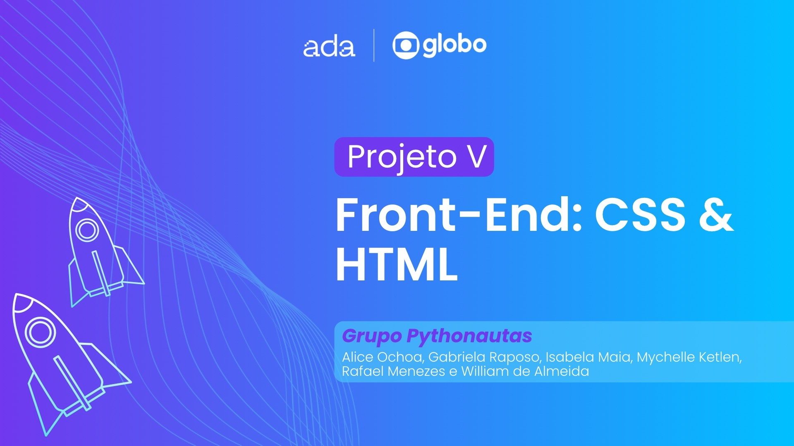
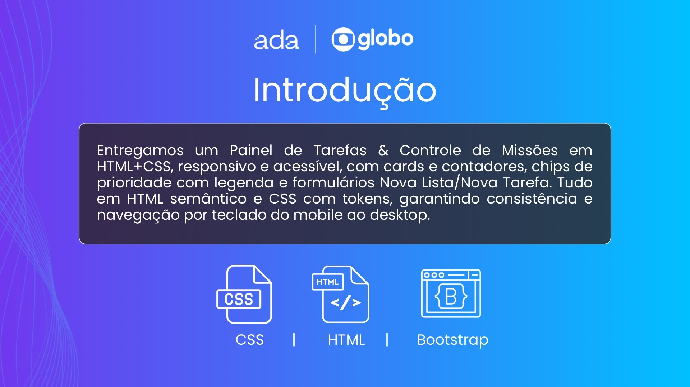
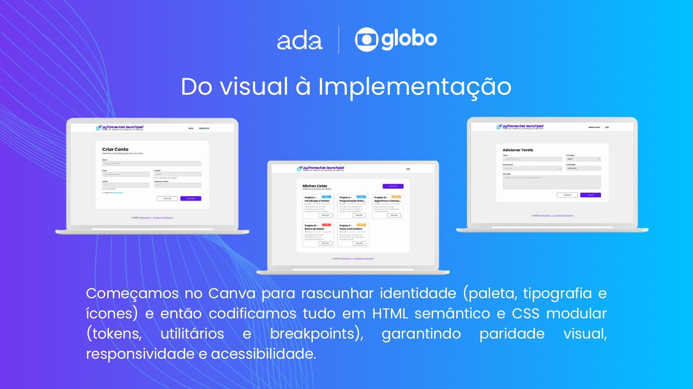

# ✅ Sistema de Controle de Tarefas (To-Do List)

Este repositório contém a implementação do projeto **Sistema de Controle de Tarefas (To-Do List)**, desenvolvido como parte da disciplina de **Front-End Estático (FE-HTML-CSS)** da Ada Tech.

O objetivo é criar um programa web que permita a **gestão de usuários, listas de tarefas e suas respectivas atividades**, praticando a estruturação de páginas, navegação entre telas, estilização e responsividade.

---

## 🎯 Objetivos do Projeto

- Construir interfaces para gerenciamento de usuários e suas listas de tarefas
- Criar páginas para adicionar, listar, editar e excluir informações
- Trabalhar com **mock de dados** (dados definidos diretamente no HTML/CSS)
- Praticar conceitos de **estruturação e responsividade**

⚠️ **Importante:** Nesta fase, os dados **não serão dinâmicos**. A manipulação real (com JavaScript) será feita apenas no módulo seguinte: **FE-JS-002 (Front-End Dinâmico)**.

---

## ✨ Funcionalidades Esperadas

- Criar um novo usuário
- Criar uma nova lista de tarefas para um usuário
- Remover uma lista de tarefas para um usuário
- Adicionar tarefas a uma lista
- Listar todas as listas de um usuário
- Listar todas as tarefas de uma lista
- Marcar tarefa como concluída
- Remover uma tarefa de uma lista

---

## 👥 Equipe

Este projeto foi desenvolvido em grupo na disciplina **Construção de Páginas Web II** da Ada Tech.

- [Falk Dev](https://github.com/falk-dev)  
- [Alice Ochoa](https://github.com/aliceochoa)  
- [Will Costa](https://github.com/Williannca85)  
- [Rafael Menezes](https://github.com/devrsmenezes)  
- [Isabela Maia](https://github.com/isabelacmaia)
- [Gabriela Raposo](https://github.com/ugabiraposo)  

---

## 🖼️ Estrutura das Páginas

- **Página inicial** → acesso aos usuários
- **Página de usuário** → visualização e criação de listas
- **Página de lista** → visualização, adição e gerenciamento de tarefas
- **Estilo** → responsivo e amigável, garantindo boa usabilidade em desktop e mobile

---

## 🎨 Avaliação

Os seguintes pontos serão considerados:

- Estruturação das páginas em HTML
- Estilização em CSS
- Navegação entre telas
- Responsividade
- Clareza e organização do código

---

## 📑 Apresentação & Review
Abaixo você encontra os slides que apresentamos durante nossa entrega: a introdução, seguida da organização e metologia, após isso, do visual à implementação do código, os principais desafios que enfrentamos e, por fim, nossos agradecimentos.

---

## 🔮 Observação

Opcionalmente, pode-se desenhar a **modelagem do banco de dados** para armazenar os dados em versões futuras (tanto relacional quanto NoSQL). Ferramentas como **draw.io** podem ser utilizadas para isso, mas não será um requisito de avaliação.

---

> _"Pequenos passos, grandes conquistas. Um To-Do de cada vez."_ ✅
